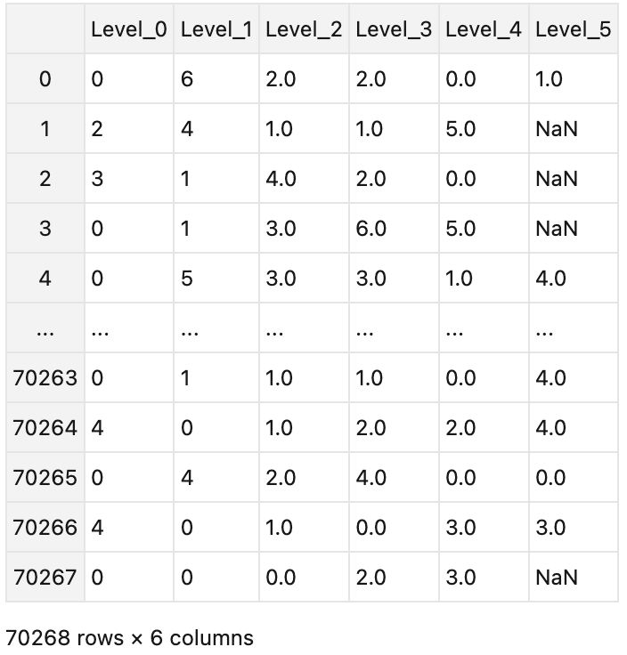

# Recursive cluster
## Description
Welcome to the Dynamic Clustering package : )  This package provides a comprehensive solution for dynamic clustering of multidimensional data using KMeans, the Elbow method for identifying optimal clusters, and a recursive approach to build hierarchical clusters. We'll guide you installing and using the package effectively.

## Features
1. PCPTest: Use permutation test to determine whether a dataset can be clustered
2. Dynamic Clustering: Performs hierarchical clustering using recursive methodologies.
2. Cluster Stability Validation: Implements predictive cohesion and PCA variance tests to validate cluster stability via a Predictive Cohesion Partition Test.
3. Optimal Cluster Identification: Finds the optimal number of clusters based on an Elbow method assessment.
4. Dimensionality Reduction: Reduces the dimensionality of input data using Principal Component Analysis (PCA).
5. Definition-Based Data Transformation: Provides functions to convert hierarchical cluster paths into pandas DataFrame and prune tree levels if required.

## Installing
To use this package, please enter the following the code in your command line window.
``` 
pip install recursivecluster
```
Enter the following code in your python. 
```
from resclu import *
```

## Example
Here's a step-by-step guide to using the package with an example data fole.
1. Data Preparation: Load your dataset into a pandas DataFrame.
Get Example dataset at:  https://github.com/zondaxyz/resclu/blob/main/ECCBCluster01.csv 
(A preprocessed dataset from:https://www.kaggle.com/datasets/hunter0007/ecommerce-dataset-for-predictive-marketing-2023)
**Notice：The data must be of numerical type, it cannot contain strings.**
2. Import resclu package
```
from resclu import *
# Load your dataset
data = pd.read_csv('ECCBCluster01.csv')
```
3. Perform Recursive Clustering: Apply dynamic clustering recursively to achieve hierarchical clustering.


```
a = recursive_cluster(data,max_depth=6,PCAtoN=True,pth=0.01)

#Remove levels that do not meet the minimum presence threshold.
a = labels_to_dataframe(a)   

#cut level
a = cutlevel(a)   
```
4. demonstrate result
```
print(a)
```


## Parameter of Recursive_cluster( )
- `df`: This is the input pandas DataFrame that needs to be clustered.

- `max_depth`: This is an optional integer that sets the maximum depth of recursion. The default value is 10, which means the function can create a hierarchical clustering structure up to 10 levels deep.

- `sti1`: This is a parameter for the PCPTest function, controlling the number of bootstrap iterations. The default value is 100.

- `sti2`: This is a parameter for the PCPTest function, controlling the number of iterations for the 'predcoh' or 'pcavar' functions. The default value is 30.

- `pth`: This is a parameter for the PCPTest function, setting the threshold for the p-value. The default value is 0.05.

- `PCAtoN`: This is a boolean value that determines whether to use PCA for dimensionality reduction. The default value is True.

- `n_pca`: This is the target dimension for PCA dimensionality reduction. The default value is None, which means the function will automatically select a dimension such that the retained principal components can explain 95% of the variance in the original data.

- `hitvar`: This is the variance explanation threshold for PCA dimensionality reduction when `n_pca` is None. The default value is 0.95.

- `inu`: This is a boolean value that determines whether to perform sampling without replacement during the bootstrap process. The default value is False.

- `fun`: This is the function used for PCPTest, which can be 'predcoh' or 'pcavar'. The default value is 'predcoh'.

- `faster`: This is a boolean value that determines whether to use a faster method for clustering. The default value is False.
- 
## Parameter of cutlevel( )
- `t`: This is the threshold used to decide whether to drop a column. If the proportion of non-null values in a column is less than this threshold, the column will be dropped. The default value is 0.1.